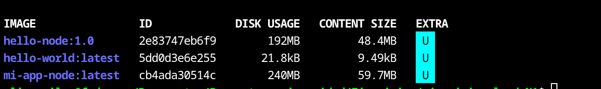
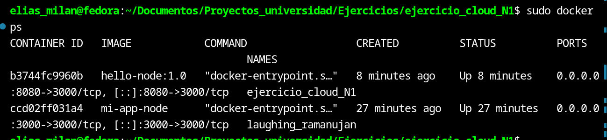
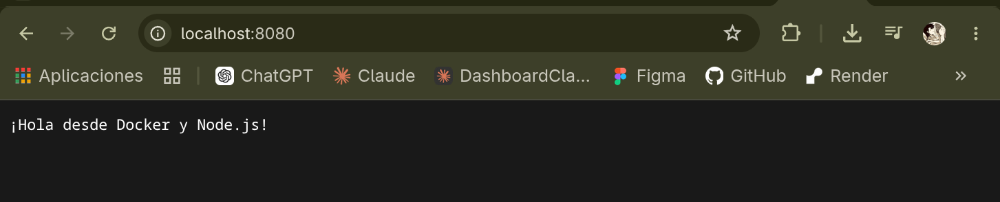

# hello-node 🐳

## Estudiante
<!-- Coloca aquí tu nombre completo -->
Elias Milan Lecona Condori


## Descripción de la aplicación
`hello-node` es una aplicación básica construida con Node.js (sin frameworks
externos, usando el módulo nativo `http`). Al iniciarse, levanta un servidor
HTTP que escucha en el puerto `3000` y responde a cualquier petición con el
mensaje:

```
¡Hola desde Docker y Node.js!
```

El objetivo del proyecto es practicar la creación de una imagen Docker
personalizada mediante un `Dockerfile`, construir dicha imagen y ejecutar la
aplicación dentro de un contenedor, mapeando puertos entre el host y el
contenedor.

## Estructura del proyecto
```
hello-node/
├── Dockerfile
├── index.js
├── package.json
├── package-lock.json
└── README.md
```

## Comando utilizado para construir la imagen
```bash
docker build -t hello-node:1.0 .
```

## Comando utilizado para ejecutar el contenedor
```bash
docker run -d \
  --name hello-node-container \
  -p 8080:3000 \
  hello-node:1.0
```

La aplicación queda disponible en el navegador en:
```
http://localhost:8080
```

## Otros comandos útiles

Listar imágenes creadas:
```bash
docker images
```

Listar contenedores en ejecución:
```bash
docker ps
```

Ver logs del contenedor:
```bash
docker logs hello-node-container
```

Detener y eliminar el contenedor:
```bash
docker stop hello-node-container
docker rm hello-node-container
```

## Capturas de pantalla

### `docker images`
<!-- Inserta aquí la captura -->


### `docker ps`
<!-- Inserta aquí la captura -->


### Aplicación funcionando en el navegador
<!-- Inserta aquí la captura -->

# construcci-n_de_una_imagen_docker
